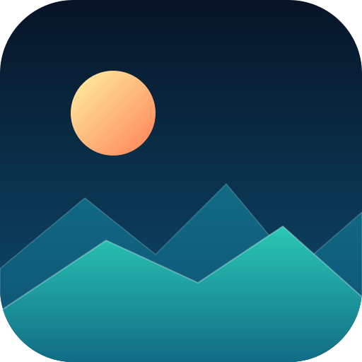
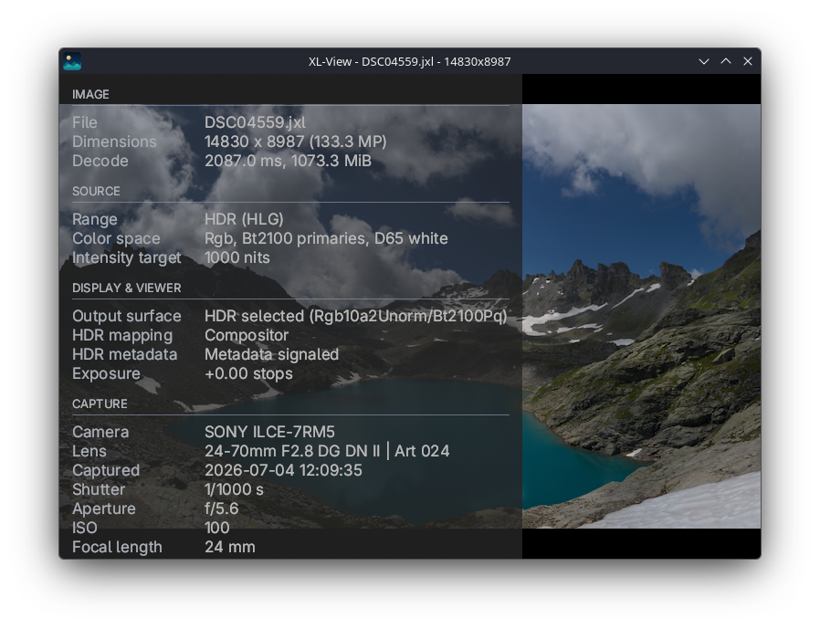

<div align="center">
  

  # XL-View

  **A minimalist HDR image viewer optimized for large images.**

  [](https://github.com/andrinbr/xl-view/actions/workflows/ci.yml)
  
  [](https://sonarcloud.io/summary/new_code?id=andrinbr_xl-view)
  [](https://sonarcloud.io/summary/new_code?id=andrinbr_xl-view)

  
</div>

XL-View is an HDR still-image viewer for Linux, built on native Wayland and
Vulkan. It preserves the full HDR range of an image when HDR output is
available, targets JPEG XL, and handles large images such as panoramas.

## Features

- **HDR presentation** via PQ, HLG, scRGB, and SDR outputs
- **Compositor-managed color** that preserves HDR range for final display mapping
- **Large image support** with asynchronous decoding and smooth image panning
- **Lanczos2 resampling** of the visible region for sharp views
- **Image cache** with folder-neighbor prefetch for fast navigation
- **EXIF metadata overlay**
- **Exposure adjustment** for inspecting highlights and shadows
- **Selectable backgrounds** to help with image inspection
- **Diagnostics mode** with an HDR test pattern and runtime reporting

## Installation

### AppImage

Download the AppImage from the [releases page](https://github.com/andrinbr/xl-view/releases),
make it executable, and run it:

```console
chmod +x xl-view-x86_64.AppImage
./xl-view-x86_64.AppImage path/to/image.jxl
```

As an alternative to running it directly, you can integrate the AppImage into
your desktop with an AppImage manager such as
[Gear Lever](https://github.com/mijorus/gearlever). Point Gear Lever at the
downloaded file and it handles installation and the menu entry.

### Building from source

The required Rust compiler is configured in
[rust-toolchain.toml](rust-toolchain.toml).

```console
git clone https://github.com/andrinbr/xl-view.git
cd xl-view
cargo build --release
./target/release/xl-view path/to/image.jxl
```

Or install it into your Cargo bin directory:

```console
cargo install --path .
```

To build the AppImage yourself, run `packaging/linux/appimage/build.sh` from the
repository root (see [packaging/linux/appimage/README.md](packaging/linux/appimage/README.md)).

## Requirements

- **Modern Linux:** HDR output requires a compositor with HDR and
  Wayland color-management support, available in recent KDE Plasma and GNOME
  releases.
- **A native Wayland session:** There is no X11 or OpenGL fallback.
- **A Vulkan-capable GPU and driver:** Vulkan drivers are available for
  recent AMD, Intel, and NVIDIA GPUs.
- **An HDR display:** for the full experience. SDR displays still work, but an
  HDR image shown on an SDR surface is tone-mapped down to SDR rather than shown
  in HDR.

## Usage

```text
Usage: xl-view [OPTIONS] [IMAGE]

Arguments:
  [IMAGE]  Image to open

Options:
      --diagnostics              Show a test pattern and print runtime/display diagnostics
      --output <OUTPUT>          Select the display output encoding [default: auto] [possible values: auto, pq, hlg, scrgb, sdr]
      --background <BACKGROUND>  Select the background used outside and behind transparent image pixels [default: black] [possible values: black, middle-gray, white, checkerboard]
      --cache <MIB>              Decoded-image cache budget in MiB [default: 25% of system RAM, at least 2048, a value of 0 disables the cache]
      --gpu-memory <MIB>         Maximum GPU image memory in MiB [default: 1024]
  -h, --help                     Print help
  -V, --version                  Print version
```

Open an image by passing it on the command line, dropping a `.jxl` file onto
the window, or pressing `O` / `Ctrl+O` to use the file picker. With no image
argument, the viewer shows a welcome screen. Use `--diagnostics` to display
the color-bar test pattern instead.

By default, the viewer tries to use an output surface that matches the source
(SDR, PQ, or HLG), then chooses the closest available alternative. Use
`--output` to force a specific encoding, `--background` to change what shows
behind transparent pixels, and `--cache` / `--gpu-memory` to tune memory use.

For debug logging, set `RUST_LOG`, e.g.
`RUST_LOG=xl_view=debug cargo run -- --diagnostics`.

## Controls

### Keyboard

| Key | Action |
| --- | --- |
| `O` / `Ctrl+O` | Open an image |
| `F` | Fit image to window |
| `1` / Numpad `1` | 1:1 (one image pixel per logical pixel) |
| `+` / `=` / Numpad `+` | Zoom in |
| `-` / Numpad `-` | Zoom out |
| `W` `A` `S` `D` | Pan up / left / down / right |
| `←` / `→` | Previous / next image in folder |
| `[` / `]` | Decrease / increase exposure |
| `R` | Reset view and exposure |
| `B` | Cycle background (black, middle gray, white, checkerboard) |
| `I` | Toggle image/output/EXIF metadata overlay |
| `F11` / `Enter` | Toggle fullscreen |
| `Esc` | Leave fullscreen |
| `Q` / `Ctrl+Q` | Quit |

### Mouse

| Input | Action |
| --- | --- |
| Left-drag | Pan |
| Scroll wheel | Zoom in / out |
| Primary double-click | Toggle fullscreen |

## Supported image formats

Currently JPEG XL (`.jxl`) only. Additional codecs may be implemented in the future (see Roadmap).

## Troubleshooting

- **No HDR or washed-out colors:** make sure HDR is enabled in your compositor
  and that your display actually supports it.
- **Check the pipeline:** run `xl-view --diagnostics` to see the selected output
  surface, whether `VK_EXT_hdr_metadata` is enabled, and whether metadata
  reached the swapchain.
- **Wrong surface selected:** override automatic selection with
  `--output pq|hlg|scrgb|sdr`.
- **It won't start:** confirm you are on a native Wayland session with a working Vulkan driver. 
- **More detail:** set `RUST_LOG=xl_view=debug` for debug logging to stderr.

## Roadmap

- Cross-platform support (Windows and macOS)
- Support for gain maps
- Additional codec support (primarily AVIF and JPEG)
- Switch to `jxl-rs` once it becomes stable

## Architecture

XL-View works like this (simplified):

1. **Decode:** A JPEG XL file is read on a background worker so the window stays
   responsive, even for very large images.
2. **Store:** Each image is converted once into a single high-precision
   (16-bit-per-channel) buffer that the rest of the app draws from.
3. **Cache:** Recently viewed images are kept within the cache budget, and
   the next and previous images in the folder are loaded ahead of time so
   browsing feels instant.
4. **Draw:** The GPU displays the image while a higher-quality CPU resize
   produces a sharp result once you stop panning.
5. **Display:** The image is sent to the display using the appropriate HDR or
  SDR encoding, and the compositor handles the final mapping to the screen.

## Contributing

Feedback and questions are welcome in
[GitHub Discussions](https://github.com/andrinbr/xl-view/discussions), and bug
reports belong in [Issues](https://github.com/andrinbr/xl-view/issues). This is
a small open-source project, so please keep reports focused and include your
compositor, GPU/driver, and `--diagnostics` output where relevant.

## License

Copyright information is available in [COPYRIGHT](COPYRIGHT). XL-View is
licensed under GPL-3.0-only, see [LICENSE](LICENSE). License information for
Rust dependencies is available in
[THIRD-PARTY-LICENSES.html](THIRD-PARTY-LICENSES.html). The bundled Adwaita
Sans font is licensed under the SIL Open Font License 1.1, see
[AdwaitaSans-LICENSE.txt](assets/fonts/AdwaitaSans-LICENSE.txt).
